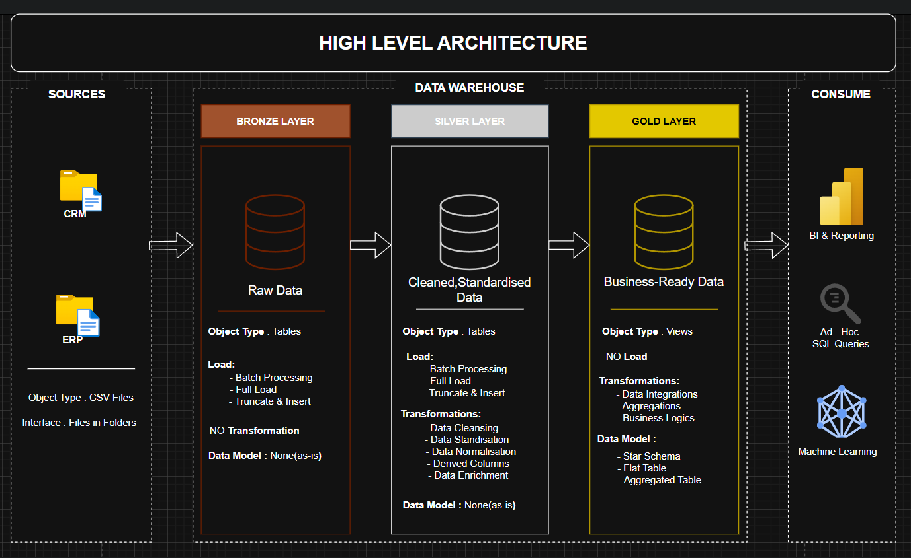

🏗️ Data Warehouse and Analytics Project

Welcome to the Data Warehouse and Analytics Project repository! 🚀
This project demonstrates a complete end-to-end data warehousing and analytics solution — from ingesting raw data to delivering actionable insights.

Designed as a portfolio project, it highlights industry best practices in modern data engineering and analytics using SQL Server.

🧱 Data Architecture

The project follows the Medallion Architecture pattern (Bronze → Silver → Gold), ensuring clean data flow, reusability, and scalability.

  

Architecture Layers
Bronze Layer – Raw Data

Object Type: Tables

Load Type: Batch | Full Load | Truncate & Insert

Transformation: None (as-is ingestion)

Data Model: None

Silver Layer – Cleaned & Standardised Data

Object Type: Tables

Load Type: Batch | Full Load | Truncate & Insert

Transformations:

Data Cleansing

Standardization

Normalization

Derived Columns

Data Enrichment

Gold Layer – Business-Ready Data

Object Type: Views

Load Type: None (Transformation Layer)

Transformations:

Data Integrations

Aggregations

Business Logic

Data Model:

Star Schema

Flat Table

Aggregated Table

Consume Layer

BI & Reporting (Power BI / Tableau)

Ad-hoc SQL Queries

Machine Learning Models

📖 Project Overview

This project covers the entire lifecycle of a modern data warehouse, including:

ETL Pipelines – Extract, Transform, and Load using SQL.

Data Modelling – Star schema and analytical models.

Data Quality Checks – Validations, cleansing, and deduplication.

Analytics & Reporting – SQL-based insights into:

Customer behavior

Product performance

Sales trends

📂 Repository Structure
data-warehouse-project/
│
├── datasets/                           # Raw CSV data from ERP and CRM
│
├── docs/                               # Detailed documentation and visuals
│   ├── data_architecture.png            # High-level data architecture diagram
│   ├── data_catalog.md                  # Data catalogue with metadata and field definitions
│   ├── data_flow.png                    # End-to-end data flow between layers
│   ├── data_integration.png             # Integration pipeline overview
│   ├── data_layers.pdf                  # Explanation of Bronze, Silver, Gold layers
│   ├── data_model.png                   # Final star schema and relationships
│   ├── ETL.png                          # ETL pipeline visual representation
│   ├── naming_conventions.md            # Standard naming guidelines for tables and columns
│   └── Project_Notes_Sketch.pdf         # Project notes, sketches, and planning references
│
├── scripts/
│   ├── bronze/                         # Load raw source data (CSV → SQL tables)
│   ├── silver/                         # Clean, transform, and standardise data
│   └── gold/                           # Create business-ready analytical models
│
├── tests/                              # Data validation and quality checks
│
├── README.md                           # Project overview and documentation
├── LICENSE                             # Open-source license
└── .gitignore                          # Ignored files and folders

⚙️ Tools & Technologies

SQL Server Express – Database and ETL execution

SQL Server Management Studio (SSMS) – Database management GUI

Draw.io – For architecture and flow diagrams

Notion – Project documentation and task tracking

GitHub – Version control and portfolio hosting

🧩 Skills Demonstrated

SQL Development & Optimisation

Data Engineering (ETL Design & Implementation)

Data Modelling (Star Schema)

Data Quality & Standardisation

Analytical SQL for Insights

Business Intelligence Concepts

🧠 Learnings & Outcome

Built a complete data warehouse from scratch using SQL.

Implemented clean, reusable ETL pipelines.

Delivered insightful SQL analytics ready for visualisation tools.

Strengthened knowledge in data architecture, design, and analytics.

👤 About Me

Hi there! I'm Muhammed Bashar Ayyoli, also known as Data with Bashar — a passionate Data Analyst in the making, who loves turning data into meaningful insights and stories.

📫 Connect with me:

🌐 GitHub

💼 LinkedIn
